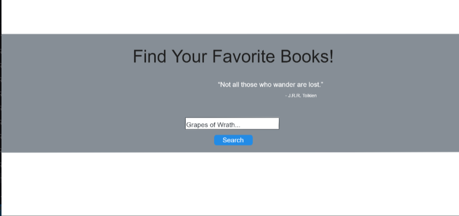

# Book Looker

This is an application designed to be able to look up any book by title or author and recieve a list of top 10 most relevent results. Users can then favorite books to save them in a list to view for later as well as mark them as "Read" or "To read". This application uses the Google Books API to handle search requests as well as API Ninjas Quotes API do display random quotes pertaining to knowledge on the main page.  

## Table of Contents
- [Technologies Used](#technologies-used)
- [Features](#features)
- [Functionality](#functionality)
- [Screenshots](#screenshots)
- [Website Link](#website-link)
- [Credits](#credits)

## Technologies used

- HTML
- CSS
- JavaScript 
- Local Storage
- [Materialize CSS](https://materializecss.com/)
- [Google Books API](https://developers.google.com/books/docs/v1/using)
- [API Ninjas Quotes API](https://api-ninjas.com/api/quotes)

## Features

- **Book Search**: Users can search for any book or author and will be redirected to a page with the top 10 most relevant book results. Each result will display the books title, author, cover, and a description of the book.
- **Favorite Books**: Users are able to save books to their favorites page to view later.
- **Read and Unread books**: On the users favorites page they are presented with cards containing their favorite books which they can toggle "Read" or "To Read".
- **Quotes Display**: Random quotes and their subsequent authors are displayed everytime the main page is reloaded.
- **Remove favorites**: Users can remove favorites from their favorites page with the remove button.

## Functionality 

All of our websites functionality is being handled in Javascript. Throughout the code there are a series of different fetch requests happening from multiple APIs.

- **Google Books API**: In our index.js we are constructing URL paremeters with user input to send a request to Google Books API. When we get our response we save the data items into local storage so we can redirect to a separate page we called cards.html, then we use the data to append information to the page in the form of cards.
- **API Ninjas Quotes**: In the index.js we also send a request to the quotes api and pass in a parameter of "knowledge" to get quotes more related to books, education, knowledge etc. We set a limit on how many characters quotes have so that they are easy to quickly read and so that long quotes wont be pushing elements out of the hero.
- **Display Results Page**: When the request is sent and a response is returned, the data items are saved into local storage. We then redirect to the cards.html which is connected to a separate cards.js. On this page we take the local storage items we saved, traverse the data to find what we need ie: author, title, cover and description. We then append this data to the html in the form of separate cards.
- **Add to Favorites**: We added a favorites button on each card that when clicked will show that youve favorited the book and then will save that books information to local storage by id. The favorite icon will also persist upon reload. We save all data associated with the card by the cards unique ID into local storage so that all data will persist unless the cache is cleared.
- **Favorites Page**: When you click on favorites in the navbar, you are redirected to the favorites.html which is connected to the favorites.js. On our ffavorites page were getting the info weve saved into local storage and presenting it on the page. We user a forEach loop to iterate over the saved array in local storage and append the data to cards. These cards are similar the the ones in the cards.html except we changed the favorite button to a remove button and added a "Read" and "to Read" toggle.
- **Read and To Read**: Books saved in favorites have a way to toggle "Read" and "To Read". This uses local storage to set the value of the toggle to true if clicked to "Read" and false if clicked to "To Read". This data will persist on reload so you always know what to read next.
- **User Input Validation**: We have also added a way so that if the user doesnt enter information in the input field, they are presented with a modal that tells them to enter a book title or author.

## Screenshots
- Wire-Framed original main page idea using Excalidraw.

- Finishing main page design.

- Short Video previewing functionality.

<video src="assets/videos/functionality-video.mp4" controls title="Title"></video>

## Website Link 
[Book Looker](https://empireantz.github.io/book-search/)

## Credits 

Credits all go to this awesome group that helped make this project shine!✨

- [Matt Hill](https://github.com/crunchwrapdestroyer)
- [Yemi Ayeni](https://github.com/rehposolihpedoc)
- [Jose Abadi](https://github.com/ajabadi)
- [Mikey Whipple](https://github.com/EmpireAntz)
